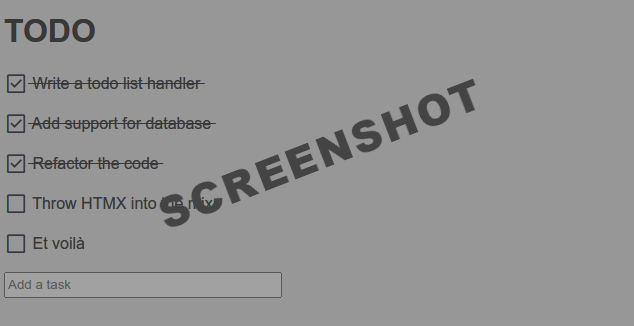

# todo
This is a simple todo app written in Go and HTMX.

## Screenshot


## Development
Local development is done using docker-compose.

Once you have `docker` set up in your machine, simply run:

```
docker-compose up
```

Once the app is running, open a browser and navigate to [http://localhost:8000](http://localhost:8000)

Hot reloading is achieved using [air](https://github.com/cosmtrek/air).

## Troubleshooting
The list id is stored in a cookie. If you want to blow it up and start over, use your browser's dev tools to delete the cookie, and refresh the page.
